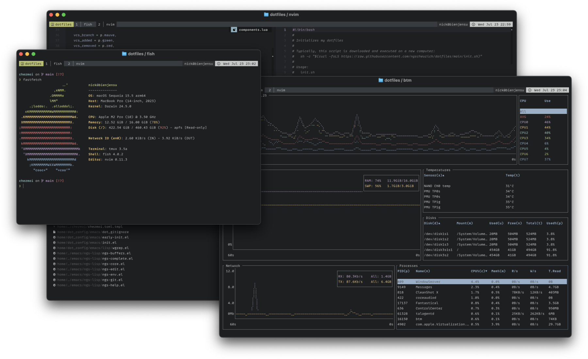

# Dotfiles



This repository contains everything I need to set up and maintain a personalized computer system. Wanderers beware: this place is ever-evolving and fraught with great peril.

## Prelude

_Computers, huh?_ Who would have thought? And yet, here we are. These are my setup and configuration files.

I’ve published them here so that folks such as you or future I might extract some wisdom from them, or perhaps just be humorously confounded. Your mileage, as they say, may vary. Also, this proves a handy place to back them up so I can pull them down onto new machines.

The files are managed with [chezmoi] and can be initialized on a new machine with [init.sh].

## Quickstart

Getting a new system up and running is just a `curl` away:

```sh
bash -c "$(curl -fsLS https://raw.githubusercontent.com/ngscheurich/dotfiles/main/init.sh)"
```

### What this script does

This is an automation script that helps me install and configure the programs I rely on. Namely, it:

1. Installs dependencies for this script to run
2. Installs chezmoi
3. Ensures a [1Password] user is active (for chezmoi templates)
4. Initializes and applies my current chezmoi state

Additionally, if the platform is [Darwin] (macOS), a couple of additional programs are installed:

- macOS command line developer tools
- [Homebrew]

### Idempotency

The script attempts to skip work that is unnecessary or has already been completed, so don't be (too) wary about running it multiple times.

### Cleanup

The script will make a temporary directory for any files it needs to create or download, and it will try to clean it up.

## Afterwards

Once you’re settled in, you might consider adding a bit more gear to your pack.

📖 How about some [useful incantations]?

```sh
bash -c "$(curl -fsLS https://raw.githubusercontent.com/ngscheurich/grimoire/main/init.sh)"
```

🎨 Perhaps you’d fancy a bit [more color] in your life?

```sh
bash -c "$(curl -fsLS https://raw.githubusercontent.com/ngscheurich/themes/main/init.sh)"
```

[1password]: https://1password.com/
[chezmoi]: https://www.chezmoi.io/
[homebrew]: https://brew.sh/
[init.sh]: init.sh
[more color]: https://github.com/ngscheurich/themes
[useful incantations]: https://github.com/ngscheurich/grimoire
