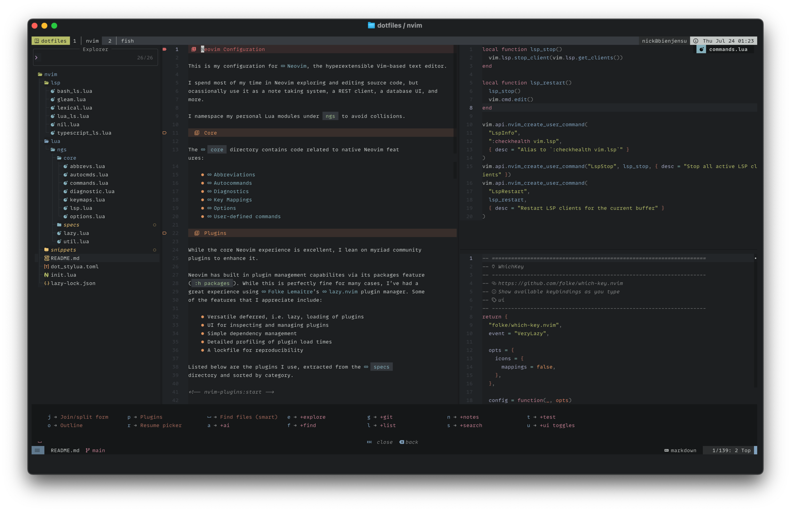

# Neovim Configuration

This is my configuration for [Neovim], the hyperextensible Vim-based text editor.

I spend most of my time in Neovim exploring and editing source code, but
ocassionally use it as a note taking system, a REST client, a database UI, and
more.

I namespace my personal Lua modules under `ngs` to avoid collisions.

## Core

The [`core`](lua/ngs/core) directory contains code related to native Neovim features:

- [Abbreviations](lua/ngs/core/abbrevs.lua)
- [Autocommands](lua/ngs/core/autocmds.lua)
- [Diagnostics](lua/ngs/core/diag.lua)
- [Key Mappings](lua/ngs/core/keymaps.lua)
- [Options](lua/ngs/core/abbrevs.lua)
- [User-defined commands](lua/ngs/core/usercmds.lua)

## Plugins

While the core Neovim experience is excellent, I lean on myriad community
plugins to enhance it.

Neovim has built in plugin management capabilites via its packages feature
(`:h packages`). While this is perfectly fine for many cases, I’ve had a
great experience using [Folke Lemaitre]’s [lazy.nvim] plugin manager. Some
of the features that I appreciate include:

- Versatile deferred, i.e. lazy, loading of plugins
- UI for inspecting and managing plugins
- Simple dependency management
- Detailed profiling of plugin load times
- A lockfile for reproducibility

Listed below are the plugins I use, extracted from the [`specs`](lua/ngs/specs)
directory and sorted by category.

<!-- nvim-plugins:start -->

### Completion

- [Blink Completion](https://cmp.saghen.dev/): Performant, batteries-included completion

### Editing

- [TreeSJ](https://github.com/Wansmer/treesj): Split/join blocks of code
- [dial.nvim](https://github.com/monaqa/dial.nvim): Enhanced increment/decrement
- [flash.nvim](https://github.com/folke/flash.nvim): Navigate using search labels
- [mini.align](https://github.com/echasnovski/mini.nvim/blob/main/readmes/mini-align.md): Align text interactively
- [mini.pairs](https://github.com/echasnovski/mini.nvim/blob/main/readmes/mini-pairs.md): Automatically inserts the other half of a character pair
- [mini.surround](https://github.com/echasnovski/mini.nvim/blob/main/readmes/mini-surround.md): Actions for operating on surrounding pairs

### Formatting

- [Conform](https://github.com/stevearc/conform.nvim): Lightweight yet powerful formatter

### Linting

- [nvim-lint](https://github.com/mfussenegger/nvim-lint): Asynchronous linter

### Miscellaneous

- [Conjure](https://github.com/Olical/conjure): Conversational software development
- [Kulala](https://github.com/mistweaverco/kulala.nvim): Fully-featured HTTP client
- [bigfile (snacks.nvim)](https://github.com/folke/snacks.nvim/blob/main/docs/bigfile.md): Deal with big files
- [bigfile (snacks.nvim)](https://github.com/folke/snacks.nvim/blob/main/docs/bigfile.md): Deal with big files
- [ccc.nvim](https://github.com/uga-rosa/ccc.nvim): Color picker and highlighter
- [image (snacks.nvim)](https://github.com/folke/snacks.nvim/blob/main/docs/image.md): Image viewer using Kitty Graphics Protocol
- [quickfile (snacks.nvim)](https://github.com/folke/snacks.nvim/blob/main/docs/quickfile.md): Render files as quickly as possible
- [rsi.vim](https://github.com/tpope/vim-rsi): Readline-style mappings
- [vim-dadbod-ui](https://github.com/kristijanhusak/vim-dadbod-ui): Relational database client

### Notes

- [obsidian.nvim](https://github.com/obsidian-nvim/obsidian.nvim): Write in and navigate Obsidian vaults

### Prose

- [Markview](https://github.com/OXY2DEV/markview.nvim): Hackable document previewer
- [peek.nvim](https://github.com/toppair/peek.nvim/tree/master): Live Markdown previewer

### Snippets

- [nvim-scissors](https://github.com/chrisgrieser/nvim-scissor): Snippet creation and management

### Source Control

- [Diffview.nvim](https://github.com/sindrets/diffview.nvim): Tab page interface for working with Git diffs
- [Gitsigns](https://github.com/lewis6991/gitsigns.nvim): Git integration for buffers
- [Neogit](https://github.com/folke/lazydev.nvim): Interactive Git interface inspired by Magit
- [fugitive.vim](https://github.com/tpope/vim-fugitive): A Git wrapper so awesome, it should be illegal
- [gitbrowse (snacks.nvim)](https://github.com/folke/snacks.nvim/blob/main/docs/gitbrowse.md): Open the current file, branch, commit, or repo in a browser
- [mini.diff](https://github.com/echasnovski/mini.nvim/blob/main/readmes/mini-diff.md): Work with diff hunks

### Testing

- [Neotest](https://github.com/nvim-neotest/neotest): Extensible framework for interacting with tests

### Tree-Sitter

- [nvim-treesitter-textobjects](https://github.com/nvim-treesitter/nvim-treesitter-textobjects): Syntax-aware text-objects and movements
- [nvim-treesitter](https://github.com/nvim-treesitter/nvim-treesitter): Tree-sitter configurations and abstraction layer

### User Interface

- [Aerial](https://github.com/stevearc/aerial.nvim): Code outline window
- [Fidget](https://github.com/j-hui/fidget.nvim): Extensible UI for Neovim notifications and LSP progress messages
- [Heirline](https://github.com/rebelot/heirline.nvim): Statusline framework designed around recursive inheritance
- [Trouble](https://github.com/folke/trouble.nvim): Interactive listing of diagnostics, references, and more
- [WhichKey](https://github.com/folke/which-key.nvim): Show available keybindings as you type
- [bufferline.nvim](https://github.com/akinsho/bufferline.nvim): A bufferline to display tabs
- [dropbar.nvim](https://github.com/Bekaboo/dropbar.nvim): Document breadcrumbs bar
- [incline](https://github.com/b0o/incline.nvim): Lightweight floating statuslines
- [indent (snacks.nvim)](https://github.com/folke/snacks.nvim/blob/main/docs/indent.md): Indent guides and scopes
- [mini.base16](https://github.com/echasnovski/mini.nvim/blob/main/readmes/mini-base16.md): Theme implementing the Base16 spec
- [notifier (snacks.nvim)](https://github.com/folke/snacks.nvim/blob/main/docs/notifier.md): Enhanced `vim.notify`
- [nvim-scrollbar](https://github.com/petertriho/nvim-scrollbar): Extensible scrollbar
- [nvim-ufo](https://github.com/kevinhwang91/nvim-ufo): High-performance folds with a modern look
- [smear-cursor.nvim](https://github.com/sphamba/smear-cursor.nvim): Animates the cursor with a smear effect
- [statuscolumn (snacks.nvim)](https://github.com/folke/snacks.nvim/blob/main/docs/statuscolumn.md): Enhanced statuscolumn
- [tiny-glimmer.nvim](https://github.com/rachartier/tiny-glimmer.nvim): Adds subtle animations to some operations
- [zen (snacks.nvim)](https://github.com/folke/snacks.nvim/blob/main/docs/zen.md): Distraction-free editing

### Workflow

- [lazydev.nvim](https://github.com/folke/lazydev.nvim): LuaLS setup for Neovim
- [mini.bracketed](https://github.com/echasnovski/mini.nvim/blob/main/readmes/mini-bracketed.md): Move back and forth between locations
- [oil.nvim](https://github.com/stevearc/oil.nvim): Explore the filesystem and edit it like a buffer
- [picker (snacks.nvim)](https://github.com/folke/snacks.nvim/blob/main/docs/picker.md): Fuzzy picker for selecting items from sources
- [quicker.nvim](https://github.com/stevearc/quicker.nvim): Improved UI and workflow for the quickfix list

<!-- nvim-plugins:end -->

[folke lemaitre]: https://folke.io/
[lazy.nvim]: https://github.com/folke/lazy.nvim
[my terminal emulator]: https://ghostty.org/
[neovim]: https://neovim.io/